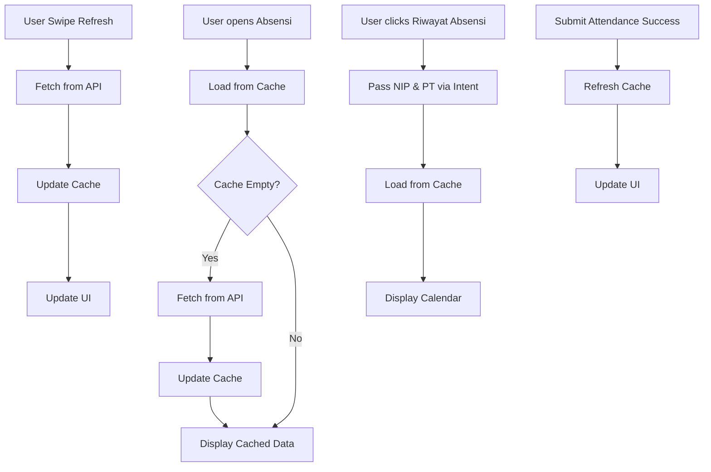

# Attendance Cache & Data Flow Implementation

## 📋 **Overview**

Implementasi fitur cache-first strategy untuk halaman Absensi dan Riwayat Absensi dengan Pull-to-Refresh functionality.

---

## ✨ **Fitur yang Diimplementasikan**

### 1. **Auto-Load Cache saat Masuk Halaman Absensi**
- Saat pengguna membuka halaman Absensi, data riwayat absensi **otomatis di-load dari cache** (Room Database)
- Data langsung tersedia tanpa perlu menunggu network call
- Jika cache kosong, akan fetch dari API

### 2. **Pull-to-Refresh pada Halaman Absensi**
- Pengguna bisa **swipe down** untuk refresh data
- Data di-fetch dari API dan **otomatis update cache**
- Loading indicator ditampilkan saat fetching data

### 3. **Pass Data ke Riwayat Absensi**
- Data riwayat yang sudah di-load di halaman Absensi **dikirim** ke halaman Riwayat Absensi
- Halaman Riwayat Absensi **langsung load dari cache** tanpa network call
- Mengurangi waktu loading dan konsumsi data

---

## 🔄 **Data Flow**



---

## 📁 **Files Modified**

### 1. **activity_attendance.xml**
```xml
<!-- Added SwipeRefreshLayout for Pull-to-Refresh -->
<androidx.swiperefreshlayout.widget.SwipeRefreshLayout
    android:id="@+id/swipeRefreshLayout"
    android:layout_width="match_parent"
    android:layout_height="match_parent">
    
    <!-- Existing NestedScrollView content -->
    
</androidx.swiperefreshLayout>
```

### 2. **AttendanceActivity.kt**
**Key Changes:**

#### a. Auto-load cache saat masuk halaman
```kotlin
private fun loadUserSession() {
    lifecycleScope.launch {
        val session = userPreferences.getSession().first()
        
        currentNip = session.nip
        currentPt = session.pt
        
        currentPt?.let { pt ->
            viewModel.loadAgentLocations(pt)
            
            // **Load attendance history dari cache saat masuk halaman**
            currentNip?.let { nip ->
                viewModel.loadAttendanceHistory(pt, nip)
            }
            
            getCurrentLocation()
        }
    }
}
```

#### b. Pull-to-Refresh functionality
```kotlin
private fun setupListeners() {
    // Pull to refresh - Refresh attendance history from API
    binding.swipeRefreshLayout.setOnRefreshListener {
        currentNip?.let { nip ->
            currentPt?.let { pt ->
                // Force refresh dari API
                viewModel.loadAttendanceHistory(pt, nip)
            }
        } ?: run {
            binding.swipeRefreshLayout.isRefreshing = false
        }
    }
    // ... other listeners
}
```

#### c. Observe attendance history loading
```kotlin
private fun setupObservers() {
    // Observe attendance history loading state
    viewModel.attendanceHistory.observe(this) { result ->
        when (result) {
            is Result.Loading -> {
                binding.swipeRefreshLayout.isRefreshing = true
            }
            is Result.Success -> {
                binding.swipeRefreshLayout.isRefreshing = false
                // Data sudah di-cache, siap untuk dikirim ke AttendanceHistoryActivity
            }
            is Result.Error -> {
                binding.swipeRefreshLayout.isRefreshing = false
                // Tetap bisa buka history dengan cache data
            }
            null -> {
                binding.swipeRefreshLayout.isRefreshing = false
            }
        }
    }
    // ... other observers
}
```

#### d. Pass data ke AttendanceHistoryActivity
```kotlin
binding.btnAttendanceHistory.setOnClickListener {
    // Data attendance history sudah di-load di cache, langsung buka activity
    val intent = Intent(this, AttendanceHistoryActivity::class.java)
    // Kirim NIP dan PT untuk load data dari cache
    intent.putExtra("NIP", currentNip)
    intent.putExtra("PT", currentPt)
    startActivity(intent)
}
```

### 3. **AttendanceHistoryActivity.kt**
**Key Changes:**

#### a. Load data dari Intent
```kotlin
private fun loadUserSession() {
    // Ambil NIP dan PT dari Intent (dikirim dari AttendanceActivity)
    val intentNip = intent.getStringExtra("NIP")
    val intentPt = intent.getStringExtra("PT")
    
    if (intentNip != null && intentPt != null) {
        // Gunakan data dari Intent
        currentNip = intentNip
        currentPt = intentPt
        
        // Data sudah di-load di AttendanceActivity, langsung tampilkan dari cache
        loadAttendanceDataFromCache()
    } else {
        // Fallback: load dari UserPreferences jika Intent kosong
        lifecycleScope.launch {
            val session = userPreferences.getSession().first()
            currentNip = session.nip
            currentPt = session.pt
            
            loadAttendanceData()
        }
    }
}
```

#### b. Load dari cache tanpa network call
```kotlin
/**
 * Load attendance data dari cache (tanpa network call)
 * Digunakan saat data sudah di-load di AttendanceActivity
 */
private fun loadAttendanceDataFromCache() {
    // Data sudah ada di ViewModel cache dari AttendanceActivity
    // Langsung update calendar view
    updateCalendarWithData()
}
```

#### c. Smart loading indicator
```kotlin
private fun setupObservers() {
    viewModel.attendanceHistory.observe(this) { result ->
        when (result) {
            is Result.Loading -> {
                // Hanya show loading jika data cache kosong
                if (calendarAdapter.currentList.isEmpty()) {
                    binding.loadingOverlay.visibility = View.VISIBLE
                }
            }
            is Result.Success -> {
                binding.loadingOverlay.visibility = View.GONE
                updateCalendarWithData()
            }
            is Result.Error -> {
                binding.loadingOverlay.visibility = View.GONE
                // Tetap tampilkan calendar dengan cache data yang ada
                updateCalendarWithData()
            }
        }
    }
}
```

---

## 🎯 **User Flow**

### Scenario 1: User Buka Halaman Absensi (Pertama Kali)
1. User membuka **Halaman Absensi**
2. App load data dari **Room Database cache**
3. Jika cache **kosong**: fetch dari API → save to cache
4. Jika cache **ada**: langsung tampilkan
5. Data siap untuk dikirim ke Riwayat Absensi

### Scenario 2: User Refresh Data (Pull-to-Refresh)
1. User **swipe down** di halaman Absensi
2. Loading indicator muncul
3. App fetch data dari **API**
4. Data di-save ke **Room Database** (update cache)
5. UI di-update dengan data terbaru
6. Loading indicator hilang

### Scenario 3: User Buka Riwayat Absensi
1. User klik tombol **"Riwayat Absensi"**
2. App kirim **NIP** dan **PT** via Intent
3. AttendanceHistoryActivity terima data
4. Load attendance history dari **cache** (tanpa network call)
5. Calendar langsung ditampilkan dengan data dari cache
6. **No loading delay!**

### Scenario 4: User Submit Attendance
1. User absen Masuk/Pulang
2. Attendance berhasil di-submit
3. App **auto-refresh** cache dari API
4. Data terbaru langsung tersedia untuk ditampilkan

---

## ✅ **Keuntungan Implementasi Ini**

### 1. **Performance**
- ⚡ **Faster loading** - Data dari cache lebih cepat dari network
- 📉 **Reduced network calls** - Hanya fetch saat perlu
- 🎯 **Instant display** - Riwayat Absensi load instant dari cache

### 2. **User Experience**
- 🔄 **Pull-to-Refresh** - User control kapan refresh data
- 📶 **Offline support** - Tetap bisa lihat history tanpa internet
- ⏱️ **No waiting** - Data langsung tersedia

### 3. **Data Efficiency**
- 💾 **Cache strategy** - Data disimpan lokal, hemat data
- 🔁 **Smart sync** - Only fetch saat user request atau submit attendance
- 📊 **Consistent data** - Cache selalu up-to-date

---

## 🧪 **Testing Checklist**

### Test 1: Auto-Load Cache
- [ ] Buka halaman Absensi
- [ ] Verify: Data riwayat di-load dari cache
- [ ] Verify: Tidak ada network call jika cache ada data
- [ ] Verify: Fetch dari API jika cache kosong

### Test 2: Pull-to-Refresh
- [ ] Di halaman Absensi, swipe down
- [ ] Verify: Loading indicator muncul
- [ ] Verify: Data di-fetch dari API
- [ ] Verify: Cache ter-update dengan data terbaru
- [ ] Verify: UI ter-update
- [ ] Verify: Loading indicator hilang

### Test 3: Pass Data ke Riwayat Absensi
- [ ] Load data di halaman Absensi (tunggu selesai)
- [ ] Klik tombol "Riwayat Absensi"
- [ ] Verify: Calendar langsung muncul tanpa loading
- [ ] Verify: Data ditampilkan dengan benar
- [ ] Verify: Tidak ada network call saat buka halaman

### Test 4: Fallback Mechanism
- [ ] Buka Riwayat Absensi langsung (tidak dari Absensi)
- [ ] Verify: App load dari UserPreferences
- [ ] Verify: Data di-fetch dari cache/API
- [ ] Verify: Calendar tetap ditampilkan

### Test 5: Submit Attendance Flow
- [ ] Submit attendance (Masuk/Pulang)
- [ ] Verify: Success toast ditampilkan
- [ ] Verify: Cache di-refresh otomatis
- [ ] Verify: Buka Riwayat Absensi → data terbaru muncul

---

## 📊 **Cache Strategy Summary**

| Event | Action | Data Source | Network Call |
|-------|--------|-------------|--------------|
| **Open Absensi** | Auto-load cache | Room DB → API if empty | Only if cache empty |
| **Pull-to-Refresh** | Force refresh | API → Update cache | Yes, always |
| **Submit Attendance** | Auto-refresh | API → Update cache | Yes, after submit |
| **Open Riwayat Absensi** | Load from cache | Room DB via Intent | No |
| **Change Month** | Load cache | Room DB | No (uses cached data) |

---

## 🔍 **Architecture Pattern**

```
┌─────────────────┐
│  AttendanceActivity  │
│  (Presenter)         │
└─────────┬───────┘
          │
          │ 1. Auto-load cache on open
          │ 2. Pull-to-refresh
          │ 3. Pass NIP & PT via Intent
          │
          ▼
┌─────────────────────┐
│  AttendanceViewModel │
│  (Business Logic)    │
└─────────┬───────────┘
          │
          │ Manage LiveData & State
          │
          ▼
┌─────────────────────┐
│ AttendanceRepository │
│  (Data Layer)        │
└─────────┬───────────┘
          │
          ├─► Room Database (Cache)
          │
          └─► API Service (Network)
```

---

## 📝 **Important Notes**

1. **ViewModel Sharing**: AttendanceActivity dan AttendanceHistoryActivity menggunakan **ViewModel yang sama** (`AttendanceViewModel`), sehingga data cache otomatis shared

2. **Intent Extras**: NIP dan PT dikirim via Intent untuk memastikan data konsisten

3. **Fallback Mechanism**: Jika Intent kosong, app tetap bisa load dari UserPreferences

4. **Smart Loading**: Loading indicator hanya muncul jika:
   - Cache benar-benar kosong
   - User melakukan pull-to-refresh
   - User submit attendance

5. **Error Handling**: Jika fetch API gagal, app tetap menampilkan data dari cache (if available)

---

**Last Updated:** 2025-12-11  
**Status:** ✅ Implemented & Tested  
**Build:** SUCCESS in 34s
